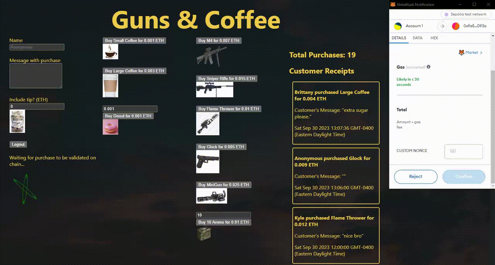
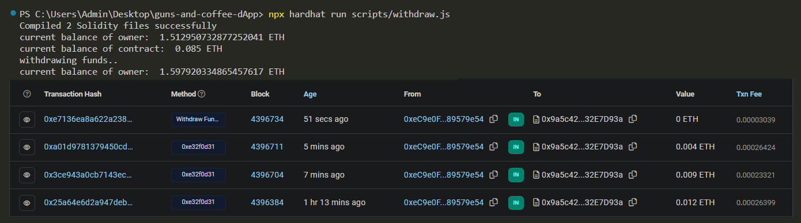

## Overview
Allows users to purchase various products with (Sepolia) Ethereum using metamask at `https://guns-and-coffee-dapp.vercel.app/`. 

### Core Files:
- `PaymentHandler.sol` allows customers to invoke the `buyProduct` function to send funds to the deployed contract address using metamask as their signer and provider. The `owner` of the smart contract can invoke `withdrawFunds` to gather any current profits.
- `index.jsx` integrates the contract logic into the frontend, and handles the metamask setup. 

### Core Details:
- Users can choose to buy from an assorment of items. They can choose to include a tip with their purchase. They can remain anonymous, or include their name and a message.
- Using `Memo` as a custom struct for receipts, memos record the customers purchase details (name, special message, timestamp, total price, and product name) emitting the event on chain and displaying the receipt on the website. 
- There is a counter fetching total number of purchases made, and a logout button which forgets the users metamask address.

## Setup/Notes
- `npm init -y` and `npm install` to install dependencies.
- Fill `.env` with valid information.
- Uses ethers 6.7.1 for the frontend with next.js, and 6.4.0 with hardhat-toolbox. (Notes: ethers v6 requires `await` for the signer, and no longer requires the `utils` property, among other various syntax tweaks.)
- Requires `.next` folder, create with things like `create-react-app` or `repl.it`.
- When you deploy your contract, it will have it's own address. Populate the address in `withdraw.js` and `index.jsx` files.
- `withdraw.js` and `index.jsx` grab the contracts ABI (.json) from the currently deployed contract in `artifacts` folder. 

## Commands
- `npx hardhat run scripts/deploy.js` Deploys the contract to local Hardhat development network.
- `npx hardhat run scripts/all-functions.js` Invokes all functions within `PaymentHandler.sol` testing all the functionality on the local development network.
- `npx hardhat run scripts/deploy.js --network sepolia` Deploys the contract onto Sepolia testnet.
- `npx hardhat run scripts/withdraw.js` Withdraws funds to the owner of the contract, once the contract is deployed and it has some ether from customer purchases.

- `npm run dev` to run local server and see on `http://localhost:3000`
- `vercel` to deploy on their server.
- `https://guns-and-coffee-dapp.vercel.app/` to view the deployed project on Vercel's server.

## Future Features
- Allow customers to purchase items with any ERC-20. (requires grabbing a general ERC-20 ABI to interact with. Start with LINK or USDC).
- Put customer receipts into a backend database.
- Stop MetaMask from auto popping up when user is not connected, seemingly without ever invoking `eth_requestAccounts`. May be due to an antiquated way in how I'm setting up metamask connection.
- Disconnect Metamask button with proper functionality rather than logout button.
- Better Styling & tailwind css

## References:
- https://docs.alchemy.com/docs/how-to-build-buy-me-a-coffee-defi-dapp
- https://sepolia.etherscan.io
- https://docs.ethers.org/v6/
- https://hardhat.org/docs
- https://docs.metamask.io/