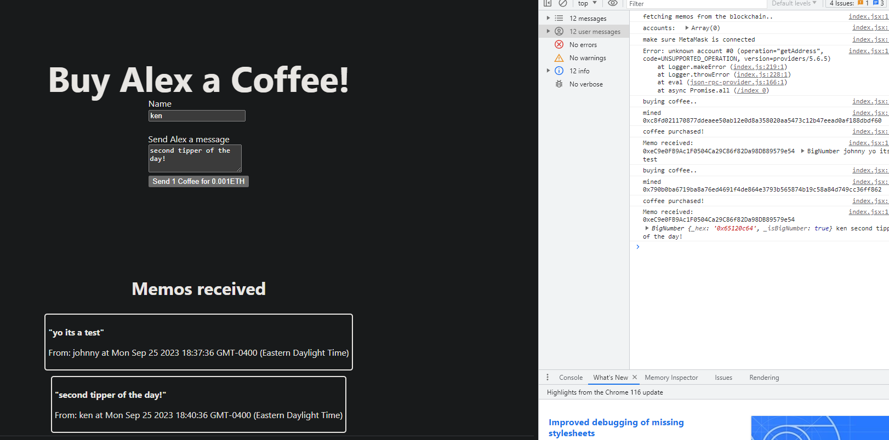

## Setup
- Clone repo, requires `npm install solc` if don't have yet.
- `npm init -y` and `npm install` to install local dependencies. (NOTE: This uses hardhat-toolbox package which is all we need now, rather than all the separate packages from hardhat shown in the original Alchemy tutorial.)
- Have a metamask dev wallet, alchemy account.
- Fill .env with valid information based on .env.example

## Summary
1. Wrote and Deployed a custom smart contract to Sepolia which allows for users to send ETH tips to the deployed contract address.
2. Owner can withdraw funds from the contract.
3. Wrote scripts to make sure all the functionality worked.
4. Integrated smart contract into front end. Also allows for metamask integration
***NOTE: When you deploy your contract, it will have it's own address. Populate it's address in the `withdraw.js` and `index.jsx` files.***

## Commands
- `npx hardhat run scripts/deploy.js` if you only want to deploy the contract to local hardhat instance and nothing else.
- `npx hardhat run scripts/all-functions.js` can be used to deploy and then test all the functionality on the local hardhat instance. 
- `npx hardhat run scripts/deploy.js --network sepolia` used to deploy onto Sepolia.
- `npx hardhat run scripts/withdraw.js` can be used once contract is deployed and it some ether from tips someone or yourself send it, you can execute this script to withdraw funds to owner (you). 
- `npm run dev` to run server and see on `http://localhost:3000`

## Scripts
- `deploy.js` does work to deploy to local hardhat instance
- `all-functions.js` does work within that instance as well to deploy and do all the functions.
- `withdraw.js` works successfully with sepolia.

## Important:
- Uses ethers 6.7.1 for the frontend with next.js, and 6.4.0 with hardhat-toolbox.
- Fixed index.jsx (using await for the signer, and some other v6 ethers syntax updates)

## Goals
- Better Styling
- purchase items with any ERC-20. (requires grabbing a general ERC-20 ABI to interact with. Start with LINK or USDC)
- Link paying customers into a database backend.

## To Do
3. Make frontend next.js/react files more simple with `create-react-app` or something similar. (optional)
Do (npx create-next-app new-project-name) in a new project, then bring that shit over, and see if it works.
4. Deploy on vercel

## References:
- https://docs.alchemy.com/docs/how-to-build-buy-me-a-coffee-defi-dapp
- https://sepolia.etherscan.io
- https://docs.ethers.org/v6/
- https://docs.metamask.io/
- https://hardhat.org/docs

